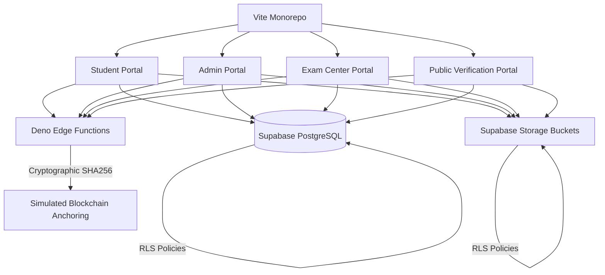

# 🎓 PARAKH Ecosystem
### Secure, Transparent & Blockchain-Anchored Board Examination Management System

PARAKH is a comprehensive, next-generation digital trust network for national-level education boards. It manages the entire lifecycle of examination administration—from blueprint design and secure exam paper printing to candidate biometric check-in, double-blind grading, blockchain results anchoring, and public certificate verification.

This repository is built as a unified **Nx Monorepo** managing 4 separate React applications, sharing a unified PostgreSQL schema, Row-Level Security (RLS) policies, and Supabase Deno Edge Functions.

---

## 🚀 Deployed Portals (Quick Links)

Below are the live portals deployed for the judges' evaluation:

| Portal | Role | Live URL |
| :--- | :--- | :--- |
| **🎓 Student Portal** | Result check, certified credentials download, exam scheduling. | `https://parakh-student.vercel.app` *(Replace with your Vercel URL)* |
| **🏢 Admin Portal** | Blueprints, secure paper sealing, auditor reviews, verifier locks. | `https://parakh-admin.vercel.app` *(Replace with your Vercel URL)* |
| **🏫 Exam Center Portal** | CCTV feed status, biometric candidate check-in, secure paper print counts. | `https://parakh-center.vercel.app` *(Replace with your Vercel URL)* |
| **🔍 Public Verification** | Cryptographic lookup and SHA-256 PDF mismatch checks. | `https://parakh-verifier.vercel.app` *(Replace with your Vercel URL)* |

---

## 🔑 Demo Credentials (For Evaluation)

Please use these pre-seeded roles to log in and test different system flows:

### 1. Student Portal (`Student`)
* **Email**: `student@parakh.gov.in`
* **Password**: `StudentPass123`
* **Role**: Candidate check-in card, marksheets, certificates download.

### 2. Admin Portal (`Controller` / `Auditor` / `Verifier`)
* **Controller (Level 3 Clearance)**:
  * **Email**: `controller@parakh.gov.in` | **Password**: `ControllerPass123`
  * **Capability**: Generate blueprints, cryptographically seal papers, issue official certificates.
* **Academic Auditor**:
  * **Email**: `auditor@parakh.gov.in` | **Password**: `AuditorPass123`
  * **Capability**: Review draft questions, accept/reject database items, audit evaluations.
* **Verifier**:
  * **Email**: `verifier@parakh.gov.in` | **Password**: `VerifierPass123`
  * **Capability**: Lock double-blind evaluations, issue certified academic results.

### 3. Exam Center Portal (`Supervisor`)
* **Email**: `supervisor@parakh.gov.in`
* **Password**: `SupervisorPass123`
* **Role**: CCTV monitoring, biometric student logs, incident reports, printing batches control.

---

## 🛠️ System Architecture



### 1. Unified Database Design ([supabase_schema_complete.sql](supabase_schema_complete.sql))
The database features 20 relational tables, speed indexes, and custom PL/pgSQL database triggers:
* **Auto-Auditing Trigger**: Automatically tracks every insert, update, or delete in `public.audit_logs`.
* **Blockchain Anchoring Trigger**: Automatically computes transaction hashes, signatures, and chains block references in `blockchain_records` upon paper generation or certificate issuance.

### 2. Secure Storage Buckets
The ecosystem provisions five security-hardened storage buckets with Row-Level Security (RLS) policies:
1. `exam-papers` (Private): Only Controllers can upload; only Supervisors can read.
2. `student-evaluation-payloads` (Private): Only Supervisors can upload; only Auditors can read.
3. `academic-credentials` (Public Read, Protected Write): Only Verifiers can upload; anyone can read.
4. `evidence-attachments` (Private): For security malpractice reports.
5. `candidate-photos` (Public Read): For biometric candidate verification cards.

### 3. Cryptographic Edge Functions ([supabase_edge_functions.md](supabase_edge_functions.md))
* `seal-paper`: Verifies Controller credentials, generates SHA-256 hash of paper metadata, locks the exam, and returns the sealed key.
* `issue-certificate`: Compiles student records, generates official PDF files using Deno `pdf-lib`, uploads them to storage, and anchors them into the blockchain ledger.
* `verify-document`: Public API that verifies certificate numbers and file hashes against the block chain.

---

## 💻 Local Setup & Development

If you wish to run the entire system locally:

1. **Install Dependencies**:
   ```bash
   npm install
   ```

2. **Configure Environment Variables**:
   Create a `.env` file in each app folder under `apps/` with your Supabase URL and Anon Key:
   ```env
   VITE_SUPABASE_URL="https://xapeorzscuwggqqocvsq.supabase.co"
   VITE_SUPABASE_ANON_KEY="sb_publishable_zctZhq8PRiP3GxhOwr2EkA_B35fngfX..."
   ```

3. **Run All Apps Simultaneously**:
   ```bash
   npx nx run-many -t dev --parallel=4
   ```
   Open your browser and navigate between:
   - Student Portal: `http://localhost:3000`
   - Public Verification: `http://localhost:3001`
   - Exam Center Portal: `http://localhost:3002`
   - Admin Portal: `http://localhost:3003`

4. **Build All Apps**:
   ```bash
   npx nx run-many -t build
   ```
