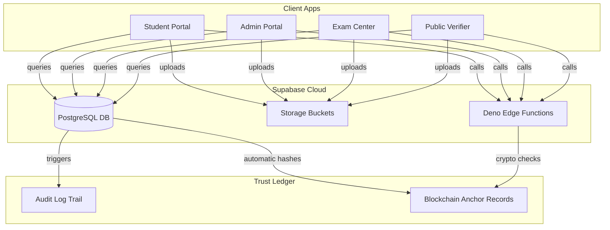
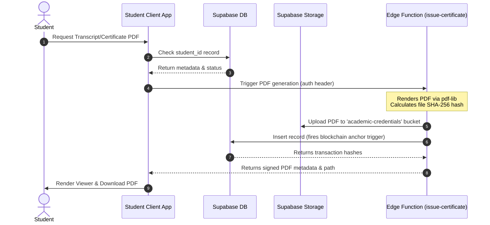
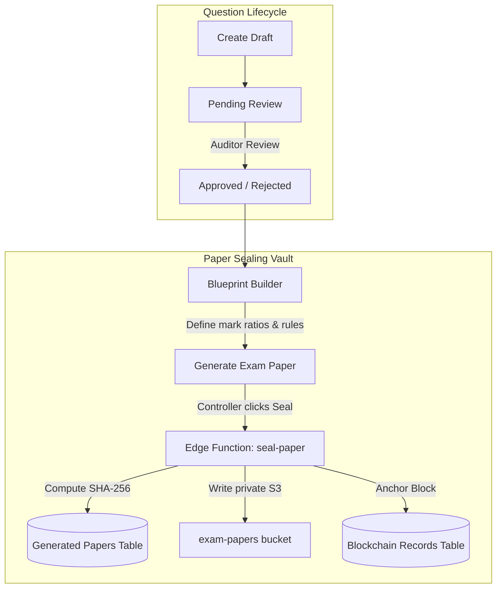
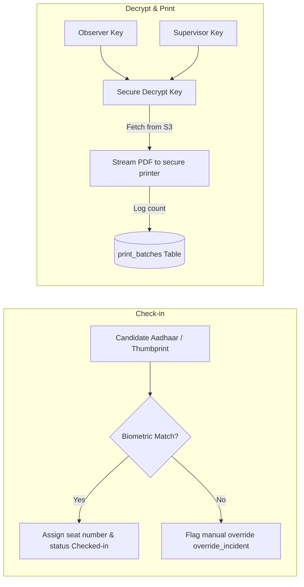
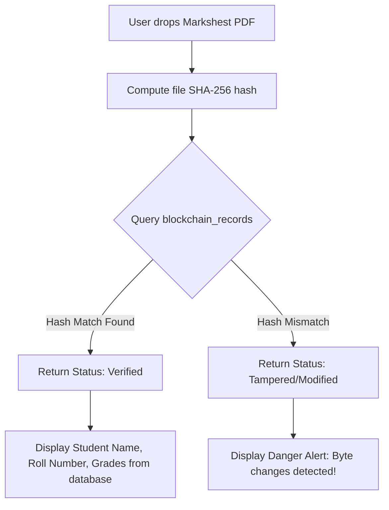

# 🎓 PARAKH Ecosystem
### Secure, Transparent & Blockchain-Anchored Board Examination Management System

<p align="center">
  
</p>

<p align="center">
  
  
  
  
  
  
  
  
</p>

---

## 📖 Overview

**PARAKH** is an advanced digital trust network designed for national-level education boards (like CBSE, NTA, etc.). It automates and secures the entire lifecycle of high-stakes examinations:
1. 📝 **Exam Design**: Dynamic syllabus blueprint mapping and difficulty distribution.
2. 🔐 **Paper Distribution**: Cryptographic sealing and secure decentralized print release.
3. 🏫 **Center Administration**: CCTV monitoring, network sniffing, and biometric candidate check-in.
4. 📊 **Grading & Verification**: Double-blind answer sheet evaluation, grading, and auditor feedback.
5. 🔗 **Trust Anchoring**: Automatic result hashes anchored to a simulated blockchain ledger for tamper-proof digital verification.

---

## 🚀 Deployed Ecosystem Portals

The PARAKH system is divided into **4 distinct portals** that run simultaneously in production. Click the badges below to access each deployed app:

---

### 1. 🎓 Student Portal
> Access results, check schedules, and download certified academic marksheets & migration certificates.
* **Live Deployment Link**: 
  [](https://parakh-student.vercel.app) *(Update URL with your deployed link)*
* **Key Features**:
  * 📜 View digital certificates, transcripts, and migration records.
  * ⬇️ Export high-fidelity PDFs with digital signature verification codes.
  * 🔔 Real-time notifications for published results and validation requests.

---

### 2. 💼 Admin & Central Command Portal
> Design blueprints, review question banks, securely seal papers, and audit evaluation pipelines.
* **Live Deployment Link**: 
  [](https://parakh-admin.vercel.app) *(Update URL with your deployed link)*
* **Key Features**:
  * ✍️ Question creator and reviewer panels with workflow status tags.
  * 📐 Blueprint builder to generate balanced exam question papers.
  * 🔏 **Sealing Vault**: Controller dashboard to cryptographically freeze papers and trigger blockchain hashes.

---

### 3. 🏫 Physical Exam Center Portal
> Local dashboard for Chief Superintendents and Observers to manage local operations securely.
* **Live Deployment Link**: 
  [](https://parakh-exam-center.vercel.app) *(Update URL with your deployed link)*
* **Key Features**:
  * 🪪 Biometric & Aadhaar e-KYC candidates check-in logging.
  * 🚨 Jammer logs & RF network sniffing sensor monitoring.
  * 🖨️ Secure print control manager with printer log auditing.

---

### 4. 🔍 Public Verification Portal
> Open-access verification hub for universities, employers, and credentials validators.
* **Live Deployment Link**: 
  [](https://parakh-public-verification.vercel.app) *(Update URL with your deployed link)*
* **Key Features**:
  * 🔍 Roll number & certificate ID instant lookup.
  * 📄 **Drag-and-Drop Validator**: Upload certificate PDFs to detect any tamper or byte modifications instantly against blockchain hashes.

---

## 🔑 Demo Credentials (For Evaluation)

Log in as different participants using these pre-seeded testing accounts:

| Role | Portal | Test Email | Password | Clearance / Privileges |
| :--- | :--- | :--- | :--- | :--- |
| **Student** | 🎓 Student | `student@parakh.gov.in` | `StudentPass123` | View own scores, download certificates. |
| **Controller** | 💼 Admin | `controller@parakh.gov.in` | `ControllerPass123` | **Clearance Level 3**: Seal papers, issue certificates. |
| **Auditor** | 💼 Admin | `auditor@parakh.gov.in` | `AuditorPass123` | **Clearance Level 2**: Review questions, audit uploads. |
| **Verifier** | 💼 Admin | `verifier@parakh.gov.in` | `VerifierPass123` | **Clearance Level 1**: Issue result locks. |
| **Supervisor** | 🏫 Exam Center | `supervisor@parakh.gov.in` | `SupervisorPass123` | CCTV monitoring, candidate check-ins, printing. |

---

## 🛡️ Technical Architecture & Security Model



---

## 💻 Modules Deep Dive

---

### 1. 🎓 Student Portal Module

The Student Portal serves as the secure interface for candidates to view details, verify documents, and download official credentials.



#### A. Architecture
* **Isolated Queries via Row-Level Security (RLS)**: Enforces `student_id = auth.uid()` on tables `public.results` and `public.certificates` so that students can access only their own records.
* **PDF Engine**: Client-side marksheet styling paired with serverless `issue-certificate` Deno function to ensure official PDF files are generated securely on the server-side.

#### B. Working Flow
1. **Dashboard Check**: The student reviews their active schedules and check-in statuses.
2. **Result Compilation**: Subject scores are returned from `public.results` as a JSON array and plotted dynamically into grade bar graphs.
3. **Download Certificate**: The student clicks download, executing the `issue-certificate` API, saving the final PDF in the S3 bucket, and returning the file with a QR verification code.

#### C. Core Features
* **Interactive marksheets** (grade bar charts, dynamic pass/fail gauges).
* **Document wallet** (Degrees, transcripts, migration certificates).
* **Audit trail logs** (history of who verified their document).

---

### 2. 💼 Admin & Central Command Module

This is the control hub used by board directors, auditors, and registrars to set up exams and securely seal question paper keys.



#### A. Architecture
* **Role-Based Clearance Controls**:
  * `ACADEMIC_AUDITOR`: Permissions restricted to checking the `questions` and `blueprints` tables.
  * `CONTROLLER`: Clearance Level 3, allowing writes to `generated_papers` and key release commands.
  * `VERIFIER`: Permission restricted to locking double-blind evaluation queues.

#### B. Working Flow
1. **Question Audit**: The Auditor accepts or rejects newly drafted questions.
2. **Dynamic Generation**: The Controller inputs standard metrics (time limit, section allocations, easy/medium/hard distribution). The generator queries the question bank and extracts a randomized set matching the rules.
3. **Vault Sealing**: The Controller enters their digital signature, executing the `seal-paper` function, locking the file in S3, and saving the SHA-256 blockchain proof.

#### C. Core Features
* **Automatic paper generators** (difficulty balancing, anti-pattern checks).
* **Double-blind grading dashboard** (allocating scanned booklets to registrars).
* **Blockchain anchor registry log** (view block history).

---

### 3. 🏫 Physical Exam Center Module

This portal operates inside physical examination centers to manage operations securely, verify candidate identities, and prevent leaks.



#### A. Architecture
* **Decentralized Printing Protocol**: Restricts printing access by requiring dual observer authentication tokens. Papers are streamed as raw print buffers rather than downloadable PDFs to prevent local saving.
* **Sniffing Sensors Integration**: Submits local RF logs and Bluetooth device entries from hardware sensors directly into the database.

#### B. Working Flow
1. **Lockdown Mode**: The Supervisor triggers lockdown, activating signal sensors.
2. **Student Check-in**: Students present their credentials, checking in with biometric validation.
3. **Dual Print Release**: The Observer and Supervisor enter their keys. The system decrypts the paper, logs the printer IP, and tracks print counts in the `print_batches` table.

#### C. Core Features
* **Local jammer & sniffer panels** (RF signal tracking, Bluetooth logs).
* **Biometric check-in logging** (attendance percentage, seating logs).
* **Incident reporter** (log impersonation, sheet exchange).

---

### 4. 🔍 Public Verification Portal

An open-access verification portal allowing universities and employers to verify document authenticity.



#### A. Architecture
* **No Authentication (Public Access)**: Accessible by anyone. RLS policies allow SELECT queries on the `certificates` and `blockchain_records` tables only for records marked as `Issued`.
* **Zero-Knowledge Check**: No student data is exposed during the drag-and-drop check until the uploaded file's hash matches the secure database hash.

#### B. Working Flow
1. **Upload PDF**: A recruiter drops the student's PDF transcript.
2. **Client-Side Hashing**: The browser computes the file's SHA-256 hash using the Web Crypto API.
3. **Database Match**: The hash is sent to the `verify-document` Edge Function. The function checks for matches in the blockchain records and returns the student metadata only if a secure match is verified.

#### C. Core Features
* **Drag-and-drop document hash validator**.
* **Direct lookup** (search by roll number or certificate ID).
* **Cryptographic consensus log viewer** (view signature, block number, previous hash).

---

## 💻 Local Setup & Development

To run all four applications simultaneously in development mode:

1. **Install Dependencies**:
   ```bash
   npm install
   ```

2. **Configure Environment variables**:
   Each app directory has a `.env` file pre-loaded with your Supabase credentials:
   ```env
   VITE_SUPABASE_URL="https://xapeorzscuwggqqocvsq.supabase.co"
   VITE_SUPABASE_ANON_KEY="sb_publishable_zctZhq8PRiP3GxhOwr2EkA_B35fngfX..."
   ```

3. **Start All Servers**:
   ```bash
   npx nx run-many -t dev --parallel=4
   ```
   Open your browser to:
   * **Student Portal**: `http://localhost:3000`
   * **Public Verification**: `http://localhost:3001`
   * **Exam Center Portal**: `http://localhost:3002`
   * **Admin Portal**: `http://localhost:3003`

4. **Build All Apps**:
   ```bash
   npx nx run-many -t build
   ```
