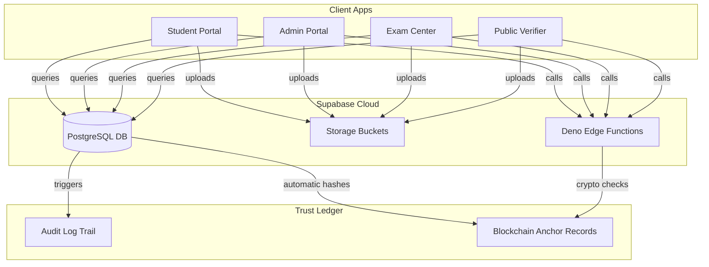
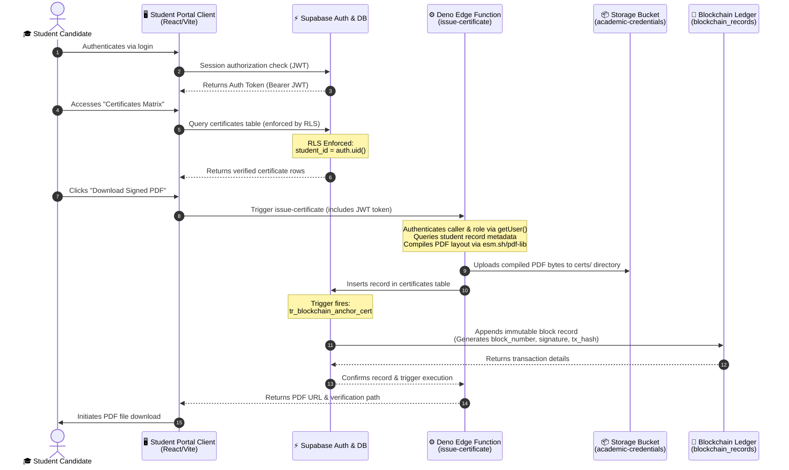
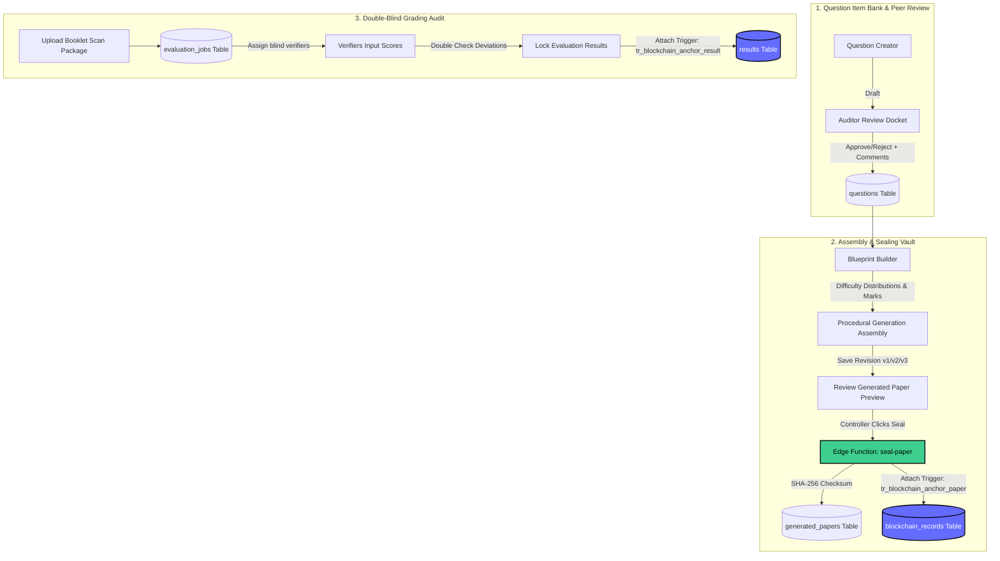
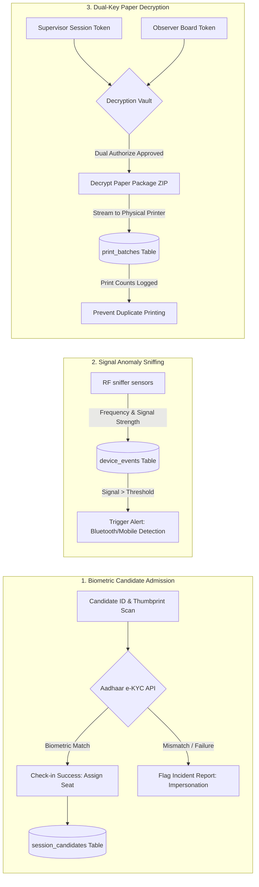
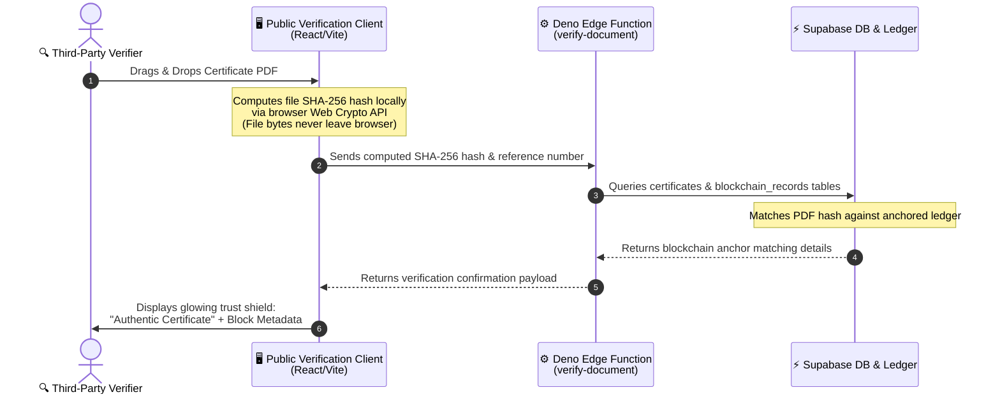

# 🎓 PARAKH Ecosystem
### Secure, Transparent & Blockchain-Anchored Board Examination Management System

<p align="center">
  
</p>

<p align="center">
  
  
  
  
  
  
  
  
</p>

---

## 📖 Overview

**PARAKH** is an advanced digital trust network designed for national-level education boards (like CBSE, NTA, etc.). It automates and secures the entire lifecycle of high-stakes examinations:
1. 📝 **Exam Design**: Dynamic syllabus blueprint mapping and difficulty distribution.
2. 🔐 **Paper Distribution**: Cryptographic sealing and secure decentralized print release.
3. 🏫 **Center Administration**: CCTV monitoring, network sniffing, and biometric candidate check-in.
4. 📊 **Grading & Verification**: Double-blind answer sheet evaluation, grading, and auditor feedback.
5. 🔗 **Trust Anchoring**: Automatic result hashes anchored to a simulated blockchain ledger for tamper-proof digital verification.

---

## 🚀 Deployed Ecosystem Portals

The PARAKH system is divided into **4 distinct portals** that run simultaneously in production. Click the badges below to access each deployed app:

---

### 1. 🎓 Student Portal
> Access results, check schedules, and download certified academic marksheets & migration certificates.
* **Live Deployment Link**: 
  [](https://parakh-student.vercel.app) *(Update URL with your deployed link)*
* **Key Features**:
  * 📜 View digital certificates, transcripts, and migration records.
  * ⬇️ Export high-fidelity PDFs with digital signature verification codes.
  * 🔔 Real-time notifications for published results and validation requests.

---

### 2. 💼 Admin & Central Command Portal
> Design blueprints, review question banks, securely seal papers, and audit evaluation pipelines.
* **Live Deployment Link**: 
  [](https://parakh-admin.vercel.app) *(Update URL with your deployed link)*
* **Key Features**:
  * ✍️ Question creator and reviewer panels with workflow status tags.
  * 📐 Blueprint builder to generate balanced exam question papers.
  * 🔏 **Sealing Vault**: Controller dashboard to cryptographically freeze papers and trigger blockchain hashes.

---

### 3. 🏫 Physical Exam Center Portal
> Local dashboard for Chief Superintendents and Observers to manage local operations securely.
* **Live Deployment Link**: 
  [](https://parakh-exam-center.vercel.app) *(Update URL with your deployed link)*
* **Key Features**:
  * 🪪 Biometric & Aadhaar e-KYC candidates check-in logging.
  * 🚨 Jammer logs & RF network sniffing sensor monitoring.
  * 🖨️ Secure print control manager with printer log auditing.

---

### 4. 🔍 Public Verification Portal
> Open-access verification hub for universities, employers, and credentials validators.
* **Live Deployment Link**: 
  [](https://parakh-public-verification.vercel.app) *(Update URL with your deployed link)*
* **Key Features**:
  * 🔍 Roll number & certificate ID instant lookup.
  * 📄 **Drag-and-Drop Validator**: Upload certificate PDFs to detect any tamper or byte modifications instantly against blockchain hashes.

---

## 🔑 Demo Credentials (For Evaluation)

Log in as different participants using these pre-seeded testing accounts:

| Role | Portal | Test Email | Password | Clearance / Privileges |
| :--- | :--- | :--- | :--- | :--- |
| **Student** | 🎓 Student | `student@parakh.gov.in` | `StudentPass123` | View own scores, download certificates. |
| **Controller** | 💼 Admin | `controller@parakh.gov.in` | `ControllerPass123` | **Clearance Level 3**: Seal papers, issue certificates. |
| **Auditor** | 💼 Admin | `auditor@parakh.gov.in` | `AuditorPass123` | **Clearance Level 2**: Review questions, audit uploads. |
| **Verifier** | 💼 Admin | `verifier@parakh.gov.in` | `VerifierPass123` | **Clearance Level 1**: Issue result locks. |
| **Supervisor** | 🏫 Exam Center | `supervisor@parakh.gov.in` | `SupervisorPass123` | CCTV monitoring, candidate check-ins, printing. |

---

## 🛡️ Technical Architecture & Security Model



---

## 💻 Modules Deep Dive

---

### 1. 🎓 Student Portal Module (`apps/parakh-student-portal`)

The Student Portal serves as a secure, authenticated interface for candidates to view active exam schedules, check published grades, and download certified academic marksheets & transcripts signed cryptographically.



#### A. Code & File Architecture
* **[`src/components/Dashboard.tsx`](file:///d:/Yash/Hackathons/Far-Away/Parakh/apps/parakh-student-portal/src/components/Dashboard.tsx)**: Main dashboard console. Compiles candidate metadata, active notifications feed, and exam schedule tickers.
* **[`src/components/ResultsModule.tsx`](file:///d:/Yash/Hackathons/Far-Away/Parakh/apps/parakh-student-portal/src/components/ResultsModule.tsx) & [`ResultDetail.tsx`](file:///d:/Yash/Hackathons/Far-Away/Parakh/apps/parakh-student-portal/src/components/ResultDetail.tsx)**: Pulls data from the `results` table. Plots marks in dynamic visual charts, calculates SGPA averages, and maps result transactions to blockchain hashes (`tx_hash`).
* **[`src/components/CertificatesModule.tsx`](file:///d:/Yash/Hackathons/Far-Away/Parakh/apps/parakh-student-portal/src/components/CertificatesModule.tsx) & [`CertificateDetail.tsx`](file:///d:/Yash/Hackathons/Far-Away/Parakh/apps/parakh-student-portal/src/components/CertificateDetail.tsx)**: Displays the student's personal credential wallet, enabling users to request PDF generation from the `issue-certificate` Deno Edge Function.
* **[`src/components/ExaminationsModule.tsx`](file:///d:/Yash/Hackathons/Far-Away/Parakh/apps/parakh-student-portal/src/components/ExaminationsModule.tsx)**: Renders digital hall tickets, schedules, subject timelines, and supervisor contact entries.
* **[`src/components/VerificationModule.tsx`](file:///d:/Yash/Hackathons/Far-Away/Parakh/apps/parakh-student-portal/src/components/VerificationModule.tsx)**: Logs third-party credentials lookups requested by external employers or universities from `verification_requests` to provide candidates transparency over who verified their data.
* **[`src/components/ProfileView.tsx`](file:///d:/Yash/Hackathons/Far-Away/Parakh/apps/parakh-student-portal/src/components/ProfileView.tsx)**: Displays full candidate profile metadata (`students` table), including DOB, school name, and masked Aadhaar reference codes (`aadhaar_reference`).
* **[`src/components/NotificationsView.tsx`](file:///d:/Yash/Hackathons/Far-Away/Parakh/apps/parakh-student-portal/src/components/NotificationsView.tsx)**: Displays dynamic system alerts, result publication notifications, and credential issuance logs.
* **[`src/components/SupportView.tsx`](file:///d:/Yash/Hackathons/Far-Away/Parakh/apps/parakh-student-portal/src/components/SupportView.tsx)**: Candidate assistance and ticket logging console.

#### B. Database Schema & API Integrations
* **Database Tables**: Reads from `students`, `results`, `certificates`, `blockchain_records`, `verification_requests`, and `notifications`.
* **Row-Level Security (RLS)**: Enforces isolation so students cannot query other candidates' details:
  ```sql
  CREATE POLICY "Student access restriction" 
  ON public.certificates FOR SELECT 
  USING (student_id = auth.uid());
  ```
* **Edge Function Call**: Dispatches authorized POST requests to `/functions/v1/issue-certificate` with the student ID, document number, name, and certificate type.

---

### 2. 💼 Admin & Central Command Module (`apps/parakh-admin-portal`)

The central command dashboard used by Board Controllers, Question Reviewers, and Verification Registrars to author question pools, build syllabus blueprints, generate secure exam papers, audit double-blind grading pipelines, and inspect blockchain transaction logs.



#### A. Code & File Architecture
* **[`src/components/DashboardModule.tsx`](file:///d:/Yash/Hackathons/Far-Away/Parakh/apps/parakh-admin-portal/src/components/DashboardModule.tsx)**: System-wide command center overview, displaying aggregate metrics of online centers, total check-ins, and active exam batches.
* **[`src/components/DronaModule.tsx`](file:///d:/Yash/Hackathons/Far-Away/Parakh/apps/parakh-admin-portal/src/components/DronaModule.tsx)**: Handles the central item bank. Features three tabs: *Question Bank* (lists and filters questions by cognitive compliance level and difficulty), *Review & Approvals* (permits auditors to approve or reject items with mandatory feedback comments), and *Activity Logs* (displays question modifications).
* **[`src/components/VedaModule.tsx`](file:///d:/Yash/Hackathons/Far-Away/Parakh/apps/parakh-admin-portal/src/components/VedaModule.tsx)**: The blueprint constructor and paper assembler. Configures blueprints (Easy, Medium, Hard percentages and Marks) and procedurally compiles papers from approved questions. Contains an amendment versioning editor allowing controllers to replace questions, adjust versions, see diffs, and invoke the Deno `seal-paper` function to lock the exam paper.
* **[`src/components/MulyaModule.tsx`](file:///d:/Yash/Hackathons/Far-Away/Parakh/apps/parakh-admin-portal/src/components/MulyaModule.tsx)**: Double-blind grading workspace. Displays scan lists and deviation metrics (calculating standard deviation `σ` and variance), flags grading discrepancies, and submits final grade commits to lock results.
* **[`src/components/SakshyaModule.tsx`](file:///d:/Yash/Hackathons/Far-Away/Parakh/apps/parakh-admin-portal/src/components/SakshyaModule.tsx)**: Blockchain explorer. Controllers input transaction hashes to query the simulated ledger (`blockchain_records`), revealing block numbers, previous hash links, signatures, and timestamps.
* **[`src/components/AdminDirectory.tsx`](file:///d:/Yash/Hackathons/Far-Away/Parakh/apps/parakh-admin-portal/src/components/AdminDirectory.tsx)**: System directories split into tabs:
  * *Users*: Manage board personnel, roles (`CONTROLLER`, `SUPERVISOR`, etc.), and hardware MFA status.
  * *CCTV & Centers*: Capacity details, VPN statuses, and CCTV overrides.
  * *Syllabus Subjects*: Setup class level (10/12) and chapter count.
  * *Sys-Logs*: Visual audit logs querying database changes.
  * *Cryptographic Keys*: Public-key registry for active signing certificates.

#### B. Database Schema & API Integrations
* **Database Tables**: Interfaces with `admin_users`, `questions`, `blueprints`, `generated_papers`, `evaluation_jobs`, `results`, `blockchain_records`, and `audit_logs`.
* **Universal Audit Logger Trigger (`proc_audit_logger`)**:
  Fires automatically on changes to `questions`, `blueprints`, `generated_papers`, and `results`. It logs JSON diffs containing old and new row values directly into `audit_logs`, tracking administrator behavior:
  ```sql
  CREATE OR REPLACE TRIGGER tr_audit_questions
  AFTER INSERT OR UPDATE OR DELETE ON public.questions
  FOR EACH ROW EXECUTE FUNCTION public.proc_audit_logger();
  ```
* **Blockchain Anchor Trigger (`proc_blockchain_anchor_simulator`)**:
  Triggered when a result is finalized or an exam paper is sealed, creating a ledger record:
  ```sql
  CREATE OR REPLACE TRIGGER tr_blockchain_anchor_paper
  AFTER INSERT ON public.generated_papers
  FOR EACH ROW EXECUTE FUNCTION public.proc_blockchain_anchor_simulator();
  ```
* **Edge Function Call**: Invokes `/functions/v1/seal-paper` with paper structures, credentials, and center boundaries to lock questions and output paper SHA-256 checksums.

---

### 3. 🏫 Physical Exam Center Module (`apps/parakh-exam-center-portal`)

A security-hardened local hub deployed in physical exam halls, managed by Chief Supervisors and Observers to coordinate candidates admission, run wireless signal scans, and decrypt paper packets minutes before testing.



#### A. Code & File Architecture
* **[`src/components/DashboardView.tsx`](file:///d:/Yash/Hackathons/Far-Away/Parakh/apps/parakh-exam-center-portal/src/components/DashboardView.tsx)**: Aggregates real-time stats including candidate check-in counts, jammer signals status, VPN tunnel states, print log warnings, and active security incidents.
* **[`src/components/CandidateVerificationView.tsx`](file:///d:/Yash/Hackathons/Far-Away/Parakh/apps/parakh-exam-center-portal/src/components/CandidateVerificationView.tsx) & [`AttendanceView.tsx`](file:///d:/Yash/Hackathons/Far-Away/Parakh/apps/parakh-exam-center-portal/src/components/AttendanceView.tsx)**: Manages candidate grids. Admits candidates by executing biometric check-in matches against Aadhaar databases, assigning seat maps, and editing attendance records.
* **[`src/components/PaperReleaseView.tsx`](file:///d:/Yash/Hackathons/Far-Away/Parakh/apps/parakh-exam-center-portal/src/components/PaperReleaseView.tsx)**: The decryption workbench. Enforces the dual-authorization protocol, requiring the Supervisor and the NTA Observer to enter their clearance keys concurrently to authorize download.
* **[`src/components/PrintControlView.tsx`](file:///d:/Yash/Hackathons/Far-Away/Parakh/apps/parakh-exam-center-portal/src/components/PrintControlView.tsx)**: Printer auditor. Coordinates local paper streaming and updates `print_batches` (auditing printer IPs, operator names, and total copies printed) to prevent duplicate paper distribution.
* **[`src/components/DeviceDetectionView.tsx`](file:///d:/Yash/Hackathons/Far-Away/Parakh/apps/parakh-exam-center-portal/src/components/DeviceDetectionView.tsx)**: RF scanner console. Logs mobile signals, smartwatches, and Bluetooth transmitters, reporting frequency (MHz) and signal strength (dBm) in `device_events`.
* **[`src/components/IncidentReportingView.tsx`](file:///d:/Yash/Hackathons/Far-Away/Parakh/apps/parakh-exam-center-portal/src/components/IncidentReportingView.tsx)**: Malpractice log dashboard. Supervisors report incidents (cheating, impersonation, delays) with critical/warning tags directly into the `incident_reports` table.
* **[`src/components/IntegrityMonitoringView.tsx`](file:///d:/Yash/Hackathons/Far-Away/Parakh/apps/parakh-exam-center-portal/src/components/IntegrityMonitoringView.tsx)**: Room-wise CCTV monitor. Simulates video feeds, captures cameras online/offline states, and triggers local lockdowns.
* **[`src/components/SessionsView.tsx`](file:///d:/Yash/Hackathons/Far-Away/Parakh/apps/parakh-exam-center-portal/src/components/SessionsView.tsx) & [`StaffView.tsx`](file:///d:/Yash/Hackathons/Far-Away/Parakh/apps/parakh-exam-center-portal/src/components/StaffView.tsx)**: Lists scheduled exam shifts and displays authorized center staff profiles.

#### B. Database Schema & API Integrations
* **Database Tables**: Interacts with `exam_centers`, `center_staff`, `exam_sessions`, `session_candidates`, `print_batches`, `device_events`, and `incident_reports`.
* **Row-Level Security (RLS)**: Restrains data queries by center boundary policies, ensuring center supervisors only access attendance logs matching their assigned `exam_center_code`.

---

### 4. 🔍 Public Verification Module (`apps/parakh-public-verification-portal`)

An open-access validation tool for third-party entities (employers, universities, registrars) to confirm academic records authenticity.



#### A. Code & File Architecture
* **[`src/components/MainVerificationModule.tsx`](file:///d:/Yash/Hackathons/Far-Away/Parakh/apps/parakh-public-verification-portal/src/components/MainVerificationModule.tsx)**: The main validator workspace. Integrates drag-and-drop file inputs, handles client-side PDF parsing, generates SHA-256 byte hashes in-browser using browser-native `window.crypto.subtle`, and calls the Deno `verify-document` backend.
* **[`src/components/RegistryLookup.tsx`](file:///d:/Yash/Hackathons/Far-Away/Parakh/apps/parakh-public-verification-portal/src/components/RegistryLookup.tsx)**: Registry search console. Resolves credentials instantly from the database by querying the unique Roll Number or Certificate ID.
* **[`src/components/AuditProofViewer.tsx`](file:///d:/Yash/Hackathons/Far-Away/Parakh/apps/parakh-public-verification-portal/src/components/AuditProofViewer.tsx)**: The blockchain block visualizer card. Displays transaction hashes (`tx_hash`), block indices, authority signatures, previous block hashes, and timestamps.
* **[`src/components/OfficialVerificationGuide.tsx`](file:///d:/Yash/Hackathons/Far-Away/Parakh/apps/parakh-public-verification-portal/src/components/OfficialVerificationGuide.tsx) & [`PrestigeIntro.tsx`](file:///d:/Yash/Hackathons/Far-Away/Parakh/apps/parakh-public-verification-portal/src/components/PrestigeIntro.tsx)**: Displays credentials validation rules, policy statements, and portal guides.

#### B. Database Schema & API Integrations
* **Database Tables**: Accesses `certificates`, `blockchain_records`, and logs lookup transactions in the `verification_requests` table.
* **Row-Level Security (RLS)**: Bypass policies permit selective public SELECT operations on certificates and blockchain anchors matching the uploaded SHA-256 signature to allow verification.
* **Edge Function Call**: Queries `/functions/v1/verify-document` with the certificate's document hash and reference ID, executing database validation and returning verification payloads.

---

## 💻 Local Setup & Development

To run all four applications simultaneously in development mode:

1. **Install Dependencies**:
   ```bash
   npm install
   ```

2. **Configure Environment variables**:
   Each app directory has a `.env` file pre-loaded with your Supabase credentials:
   ```env
   VITE_SUPABASE_URL="https://xapeorzscuwggqqocvsq.supabase.co"
   VITE_SUPABASE_ANON_KEY="sb_publishable_zctZhq8PRiP3GxhOwr2EkA_B35fngfX..."
   ```

3. **Start All Servers**:
   ```bash
   npx nx run-many -t dev --parallel=4
   ```
   Open your browser to:
   * **Student Portal**: `http://localhost:3000`
   * **Public Verification**: `http://localhost:3001`
   * **Exam Center Portal**: `http://localhost:3002`
   * **Admin Portal**: `http://localhost:3003`

4. **Build All Apps**:
   ```bash
   npx nx run-many -t build
   ```
