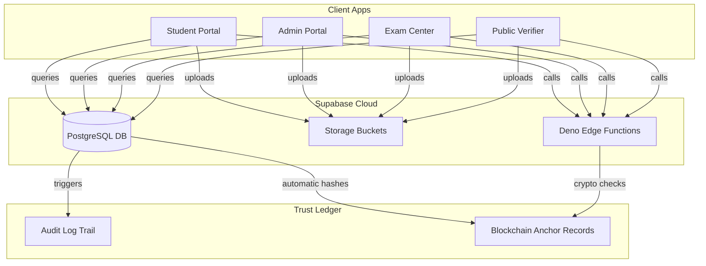

# PARAKH - Ecosystem
### Proactive Assessment and Result Audit for Knowledge & Honesty

<p align="center">
  
</p>

<p align="center">
  
  
  
  
  
  
  
  
</p>

---

## 📖 Overview

**PARAKH** is an advanced digital trust network designed for national-level education boards (like CBSE, NTA, etc.). It automates and secures the entire lifecycle of high-stakes examinations:
1. **Exam Design**: Dynamic syllabus blueprint mapping and difficulty distribution.
2. **Paper Distribution**: Cryptographic sealing and secure decentralized print release.
3. **Center Administration**: CCTV monitoring, network sniffing, and biometric candidate check-in.
4. **Grading & Verification**: Double-blind answer sheet evaluation, grading, and auditor feedback.
5. **Trust Anchoring**: Automatic result hashes anchored to a simulated blockchain ledger for tamper-proof digital verification.

---

## Deployed Ecosystem Portals

The PARAKH system is divided into **4 distinct portals** that run simultaneously in production. Click the badges below to access each deployed app:

---

### 1. Student Portal
> Access results, check schedules, and download certified academic marksheets & migration certificates.
* **Live Deployment Link**: 
  [](https://parakh-student.vercel.app)
* **Key Features**:
  *  View digital certificates, transcripts, and migration records.
  *  Export high-fidelity PDFs with digital signature verification codes.
  *  Real-time notifications for published results and validation requests.

---

### 2. Admin & Central Command Portal
> Design blueprints, review question banks, securely seal papers, and audit evaluation pipelines.
* **Live Deployment Link**: 
  [](https://parakh-admin.vercel.app)
* **Key Features**:
  * Question creator and reviewer panels with workflow status tags.
  * Blueprint builder to generate balanced exam question papers.
  * **Sealing Vault**: Controller dashboard to cryptographically freeze papers and trigger blockchain hashes.

---

### 3. Physical Exam Center Portal
> Local dashboard for Chief Superintendents and Observers to manage local operations securely.
* **Live Deployment Link**: 
  [](https://parakh-exam-center.vercel.app)
* **Key Features**:
  *  Biometric & Aadhaar e-KYC candidates check-in logging.
  *  Jammer logs & RF network sniffing sensor monitoring.
  *  Secure print control manager with printer log auditing.

---

### 4. Public Verification Portal
> Open-access verification hub for universities, employers, and credentials validators.
* **Live Deployment Link**: 
  [](https://parakh-verifier.vercel.app)
* **Key Features**:
  *  Roll number & certificate ID instant lookup.
  *  **Drag-and-Drop Validator**: Upload certificate PDFs to detect any tamper or byte modifications instantly against blockchain hashes.

---

## Demo Credentials (For Evaluation)

Log in as different participants using these pre-seeded testing accounts:

| Role | Portal | Test Email | Password | Clearance / Privileges |
| :--- | :--- | :--- | :--- | :--- |
| **Student** | Student | `student@parakh.gov.in` | `StudentPass123` | View own scores, download certificates. |
| **Controller** | Admin | `controller@parakh.gov.in` | `ControllerPass123` | **Clearance Level 3**: Seal papers, issue certificates. |
| **Auditor** | Admin | `auditor@parakh.gov.in` | `AuditorPass123` | **Clearance Level 2**: Review questions, audit uploads. |
| **Verifier** | Admin | `verifier@parakh.gov.in` | `VerifierPass123` | **Clearance Level 1**: Issue result locks. |
| **Supervisor** | Exam Center | `supervisor@parakh.gov.in` | `SupervisorPass123` | CCTV monitoring, candidate check-ins, printing. |

---

## Repository File Structure

```
d:\Yash\Hackathons\Far-Away\Parakh\
├── apps/                                  # Monorepo Portals Folder
│   ├── parakh-admin-portal/               # Central administration & command
│   ├── parakh-exam-center-portal/         # Local center secure supervisor app
│   ├── parakh-public-verification-portal/ # Public credentials validator
│   └── parakh-student-portal/             # End-candidate dashboard & marksheet portal
├── package.json                           # Root dependency workspaces setup
├── nx.json                                # Nx Monorepo configuration
├── tsconfig.base.json                     # Base TypeScript config
├── supabase_schema_complete.sql           # Unified database schema script
└── supabase_edge_functions.md             # Edge Functions code templates
```

---

## Technical Architecture & Security Model



### 1. Database Layer ([supabase_schema_complete.sql](supabase_schema_complete.sql))
- **20 Structured Tables**: Unified relational design with foreign key constraints, checks, and unique compound indexes.
- **Triggers**:
  - `proc_audit_logger`: Automatic logging of modifications to a central compliance ledger (`audit_logs`).
  - `proc_blockchain_anchor_simulator`: On insert of certificates/results/sealed papers, it automatically calculates SHA-256 block hashes and chains them with the previous transaction record.

### 2. Storage Buckets & Policies
We secure static assets using five dedicated storage buckets configured with strict RLS (Row-Level Security) policies:
* `exam-papers` (Private): Only Controllers can upload; only Supervisors can read.
* `student-evaluation-payloads` (Private): Only Supervisors can upload; only Auditors can read.
* `academic-credentials` (Public Read): Verifiers can upload; anyone can read to verify.
* `candidate-photos` (Public Read): For biometric candidate reference cards.
* `evidence-attachments` (Private): For security incident evidence uploads.

### 3. Edge Functions Layer ([supabase_edge_functions.md](supabase_edge_functions.md))
Deployable Deno TypeScript templates for:
* `seal-paper`: Restricts access to Controller, hashes exam files, and seals the database record.
* `issue-certificate`: Compiles student scores, compiles high-fidelity PDF, uploads it, and writes the blockchain transaction ledger anchor.
* `verify-document`: Public endpoint that verifies SHA-256 integrity and prints block history.

---

## Local Setup & Development

To run all four applications simultaneously in development mode:

1. **Install Dependencies**:
   ```bash
   npm install
   ```

2. **Configure Environment variables**:
   Each app directory has a `.env` file pre-loaded with your Supabase credentials:
   ```env
   VITE_SUPABASE_URL="https://xa..................sq.supabase.co"
   VITE_SUPABASE_ANON_KEY="sb_publishable_zctZ....EkA_B35fngfX..."
   ```

3. **Start All Servers**:
   ```bash
   npx nx run-many -t dev --parallel=4
   ```
   Open your browser to:
   * **Student Portal**: `http://localhost:3000`
   * **Public Verification**: `http://localhost:3001`
   * **Exam Center Portal**: `http://localhost:3002`
   * **Admin Portal**: `http://localhost:3003`

4. **Build All Apps**:
   ```bash
   npx nx run-many -t build
   ```
